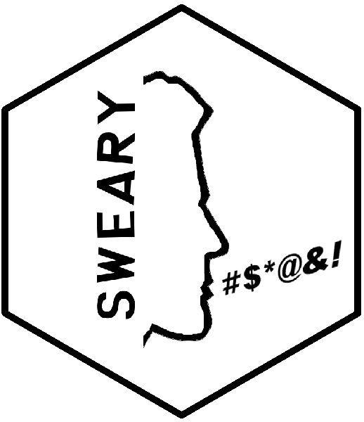

<!-- README.md is generated from README.Rmd. Please edit this file. -->

[](https://gitter.im/swearyr)
[](https://travis-ci.org/pdrhlik/sweary)

# sweary 

Sweary is an R package that contains a database of swear words from
different languages, cherry picked by native speakers.

## Installation

The development version of this package can be installed using
[devtools](https://github.com/r-lib/devtools):

    devtools::install_github("pdrhlik/sweary")

## Current swear word lists

| Language        | Language code | Number of swear words |
| --------------- | ------------- | --------------------- |
| Czech           | cs            | 57                    |
| German          | de            | 99                    |
| English         | en            | 39                    |
| French (Canada) | fr-CA         | 20                    |
| Greek           | gr            | 13                    |
| Macedonian      | mk            | 64                    |
| Polish          | pl            | 41                    |
| Romanian        | ro            | 38                    |
| Slovak          | sk            | 28                    |
| **Total**       | **9 langs**   | **399**               |

## Examples

All languages are stored in a `swear_words` data frame.

``` r
library(sweary)
head(swear_words)
```

    ## # A tibble: 6 x 2
    ##   word     language
    ##   <chr>    <chr>   
    ## 1 buzerant cs      
    ## 2 čubka    cs      
    ## 3 čurák    cs      
    ## 4 čůrák    cs      
    ## 5 debil    cs      
    ## 6 dement   cs

You can only extract one language that you are interested in.

``` r
en_swear_words <- get_swearwords("en")
head(en_swear_words)
```

    ## # A tibble: 6 x 2
    ##   word     language
    ##   <chr>    <chr>   
    ## 1 arse     en      
    ## 2 arsehole en      
    ## 3 ass      en      
    ## 4 asshole  en      
    ## 5 bitch    en      
    ## 6 bollocks en

## Add (modify) a language

If you are not comfortable with `git` and pull requests, you can just
follow steps **1-3**. After you create the file, send it to me via
[email](mailto:patrik.drhlik@gmail.com) with a subject **New sweary
language: {LANG\_CODE}**. We will acknowledge you in the README after we
approve of the changes.

1.  **Choose a new language.**  
    Find its two letter [ISO 639-1
    code](https://en.wikipedia.org/wiki/List_of_ISO_639-1_codes).  
    If the language you are creating is a certain dialect (e.g. Canadian
    French), find its [IETF language
    tag](https://en.wikipedia.org/wiki/IETF_language_tag) in this
    [language code
    table](http://www.lingoes.net/en/translator/langcode.htm).
2.  **Create a language file.**  
    Place the file in
    `data-raw/swear-word-lists/{LANG_CODE}_{LANG_NAME}`.  
    Examples:  
      - English: `data-raw/swear-word-lists/en_English`
      - Canadian French: `data-raw/swear-word-lists/fr-CA_French
        (Canada)`  
        Note that spaces and parentheses in file names are allowed.
3.  **Fill in the file with swear words.** Following rules must apply:
      - **One** swear word per line with no trailing whitespace.
      - All words must be **lowercase**.
      - The list must only contain **unique** words.
      - The list must be **sorted** alphabetically.
4.  **Make sure all the tests pass.**  
    You can do that using a development function called
    `build_sweary()`. It becomes available when you `git clone` the
    repository and call `devtools::load_all()`. Or pressing
    `Ctrl+Shift+L` in RStudio. Learn more about calling this function
    using `?build_sweary`.
5.  **Create a pull request.**

## Origin

The idea first appeared after the [South Park text analysis lightning
talk](https://github.com/pdrhlik/southparktalk-whyr2018) at the [Why
R? 2018 conference](http://whyr2018.pl/) in Wrocław. All the
contributors will be acknowledged as the work progresses.

## Acknowledgments

Here we would like to say **BIG THANKS** to native speakers that help us
with swear words dictionaries:

  - Czech - [Patrik Drhlík](https://github.com/pdrhlik)
  - English - [Patrik Drhlík](https://github.com/pdrhlik)
  - French (Canada) - [Marc-André Désautels](https://github.com/desautm)
  - German - [Peter Meißner](https://github.com/petermeissner)
  - Greek - Anonymous
  - Macedonian - [novica](https://github.com/novica)
  - Polish - [Michal Czyz](https://github.com/mczyzj)
  - Romanian - Alexandru Supeanu
  - Slovak - Šimon Žďárský
